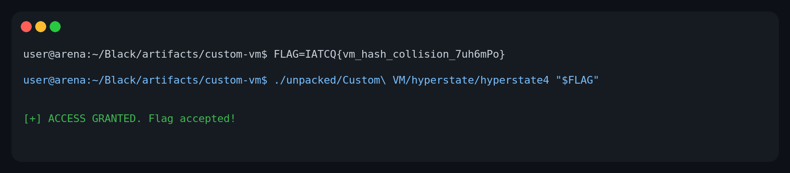

# Dark Cover — Custom VM write-up

## Flag

```text
IATCQ{vm_hash_collision_7uh6mPo}
```

This is a 32-byte, `IATCQ{...}`-formatted input accepted by the supplied checker.



The unrendered command/output shown above is also saved in [`verification.txt`](verification.txt).

---

## Files and initial triage

The supplied archive is preserved as [`Custom_VM.zip`](Custom_VM.zip).

| Item | Value |
| --- | --- |
| Archive SHA-256 | `6f88d24200011dcec7ac2621ad300bd68b545de4e9f2c7258ff69af392036632` |
| ELF SHA-256 | `0f722ac3e1cfb1b9781bc4aea871f5ee33fa5c19c8ae9b062956a93a4040a23f` |
| ELF | `unpacked/Custom VM/hyperstate/hyperstate4` — 64-bit PIE x86-64 |

The program takes exactly one argument and requires it to have length `0x20` (32) bytes. It contains two minor anti-analysis checks before the verifier:

1. `ptrace(PTRACE_TRACEME)` must succeed.
2. A two-million-iteration loop must complete in at most `0x2faf080` nanoseconds (50 ms).

Both failure paths print the same `ACCESS DENIED` message as an invalid key. A normal, non-debugged execution completes under the time threshold.

## Recovering the hidden VM

`setup_vm()` starts with a 32-bit seed of `0xc0ffee42` and decrypts 349 bytes from `.rodata`:

```c
seed = seed * 0x41c64e6d + 0x3039;      // modulo 2^32
plain_byte = encrypted_byte ^ (seed >> 16);
```

The first 256 decrypted bytes are the AES S-box (`63 7c 77 7b ...`) copied to `0x40c0`; the remaining 93 bytes are copied to `0x4060` and interpreted as VM bytecode. The VM state is a 32-byte array on the stack. The relevant opcodes are:

| Opcode | Meaning |
| --- | --- |
| `a1 dst, index_reg` | `state[dst] = argv[1][state[index_reg]]` |
| `a7 dst, src` | copy a state byte |
| `b2 dst, imm` | load an immediate byte |
| `b6 reg, _` | AES-S-box lookup |
| `c3 dst, src` | XOR state bytes and update the equality flag |
| `d4 reg, imm` | add an immediate byte |
| `e5 reg, _` | rotate a byte left by 3 |
| `f6 left, right` | update a 32-bit FNV-style accumulator |
| `17 target, _` | branch to `target` while the previous equality test is false |
| `e9 _, _` | final length/hash test |

The bytecode starts by setting byte register 1 to zero and byte register 3 to `0x42`. It processes two input bytes each loop, increments register 1 by two, and loops until it equals `0x20`.

## Equivalent verifier

After lifting the bytecode, the whole meaningful verifier reduces to this compact pseudocode. All arithmetic on `H` is modulo `2^32`; `S` is the decrypted AES S-box.

```python
P = 0x01000193
H = 0x811c9dc5
previous = 0x42

for i in range(0, 32, 2):
    a, b = key[i], key[i + 1]

    u = S[b ^ rol8(previous, 3)] ^ a
    v = S[u ^ previous ^ i] ^ b

    H = ((H ^ u) * P) & 0xffffffff
    H = ((H ^ ((v << 8) | i)) * P) & 0xffffffff
    previous = u ^ v

return H == 0x86d03165
```

The final `e9` instruction also confirms that the loop index is `0x20`. Its real security check is therefore just a 32-bit value:

```text
H == 0x86d03165
```

## Building a valid formatted preimage

The 32-bit result does **not** uniquely identify a 32-byte input. Instead of trying to recover an unknowable single original preimage, I constructed a conventional flag-shaped preimage that reaches the exact target hash.

[`analyze_vm.py`](analyze_vm.py) reproduces the LCG decryption and prints the table/bytecode split. The included [`mitm_solver.cpp`](mitm_solver.cpp) does this deterministically:

1. It fixes the readable 24-byte prefix `IATCQ{vm_hash_collision_`.
2. It enumerates four alphanumeric/underscore bytes forward from that prefix (`63^4` states).
3. It walks the final three variable bytes backwards, retaining the required `}`. Since `0x01000193` is odd, its inverse modulo `2^32` exists, so the FNV-style step can be reversed exactly.
4. It joins on the complete intermediate state: the 32-bit hash and the VM's 8-bit chaining byte.

Reproduce from this directory:

```bash
cd artifacts/custom-vm
g++ -std=c++20 -O3 -march=native -pthread -o mitm_solver mitm_solver.cpp
./mitm_solver
# IATCQ{vm_hash_collision_7uh6mPo}

./unpacked/Custom\ VM/hyperstate/hyperstate4 'IATCQ{vm_hash_collision_7uh6mPo}'
# [+] ACCESS GRANTED. Flag accepted!
```

The final execution is the verification shown in the screenshot. The locally compiled `mitm_solver` is intentionally not committed; only its source is included.
